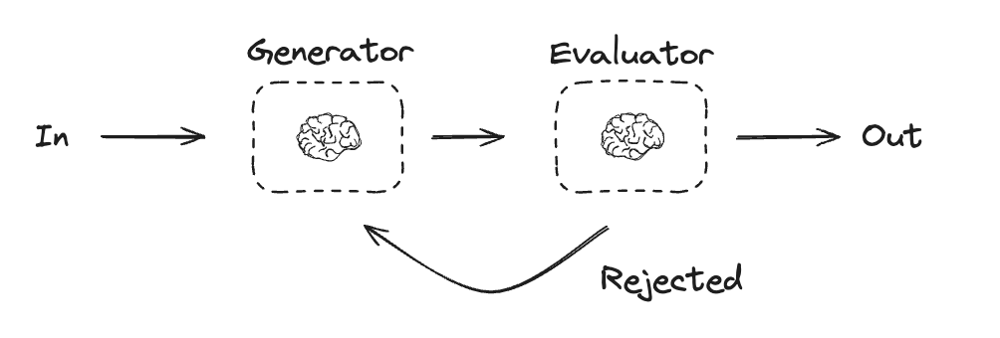

# LangGraph Workflows

LangGraph provides a set of workflows to enhance the capabilities of language models. Below is an overview of the key workflows, along with visual representations and descriptions.

## Augmented LLM

The Augmented LLM workflow integrates external tools and data sources with a language model to improve its performance and expand its capabilities. This allows the model to handle tasks that require additional context or specialized knowledge.

## Prompt Chaining

Prompt Chaining involves breaking down complex tasks into smaller, manageable steps. Each step is handled by a separate prompt, and the outputs are passed sequentially to achieve the desired result.

## Parallelization

The Parallelization workflow enables the execution of multiple tasks simultaneously. This approach is ideal for scenarios where independent tasks can be processed in parallel, significantly improving efficiency.

## Routing

Routing dynamically directs tasks to the most appropriate model or workflow based on the input. This ensures that each task is handled by the best-suited resource, optimizing performance and accuracy.

## Worker

The Worker workflow is designed for distributed task execution. It allows tasks to be offloaded to dedicated workers, enabling scalable and efficient processing of large workloads.

## Evaluator Optimizer

The Evaluator Optimizer workflow focuses on assessing and improving the performance of language models. Using another model as an evaluator, it provides feedback loop to refine the output of the primary model. This iterative process enhances the quality and relevance of the generated content.

## References

- [LangGraph Workflows Tutorial](https://langchain-ai.github.io/langgraph/tutorials/workflows/#set-up): A comprehensive guide to setting up and using LangGraph workflows.
